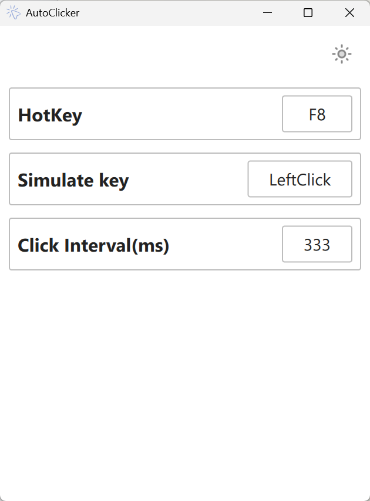
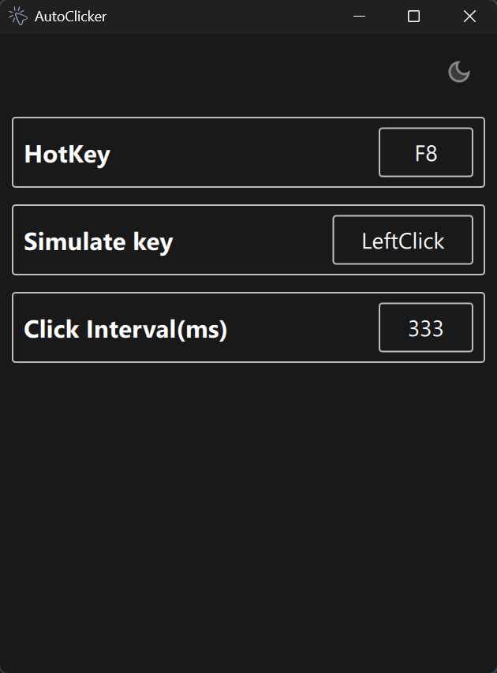

# AutoClicker

This app is a Simplified  auto clicker on windows platform.

[install](https://github.com/yanqi1711/auto-clicker/releases)

### Feature
- Click at a specific interval
- Start/Stop clicking with a hotkey
- Set custom hotkey
- Set custom click interval
- Light/Dark mode
- Shift + ESC to exit the app

### Example
&nbsp;&nbsp;

### License
MIT License